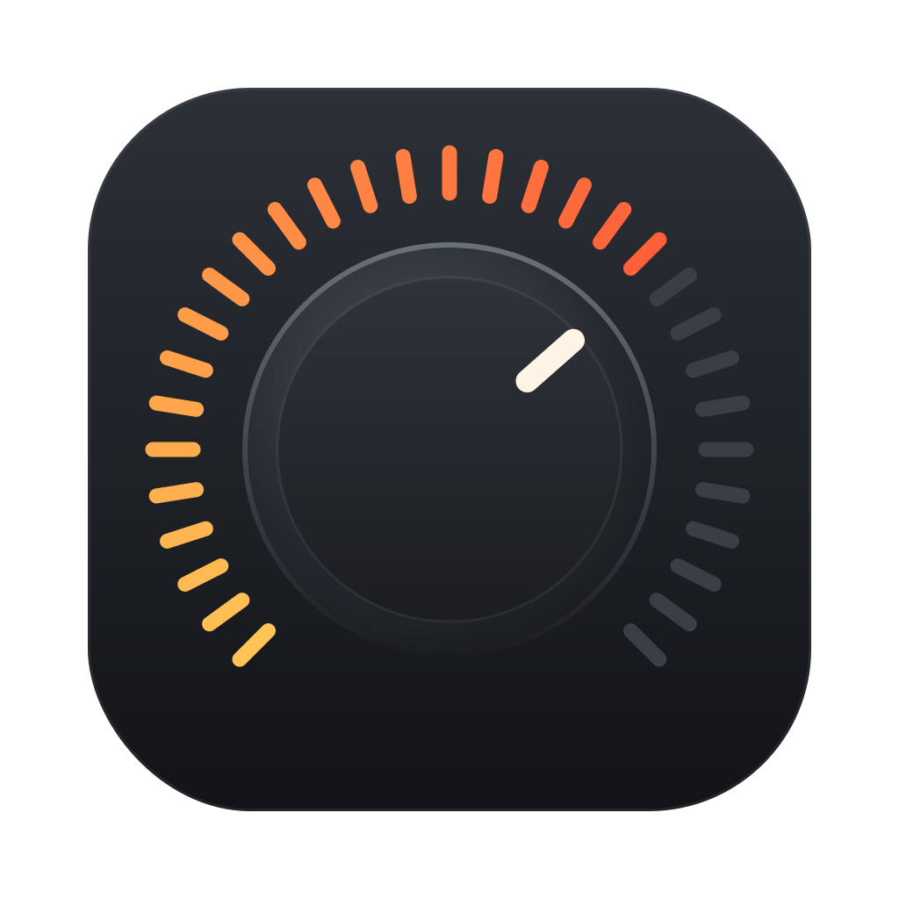
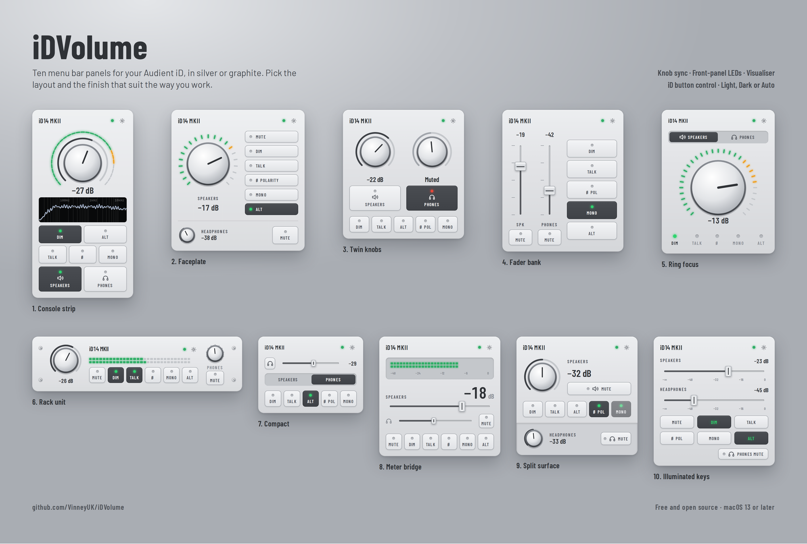
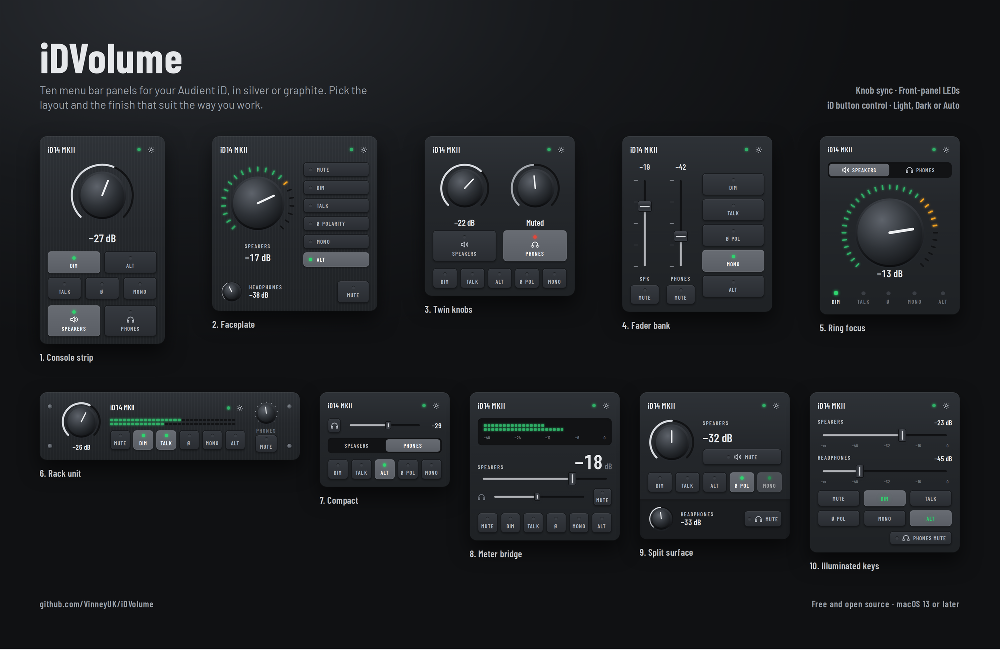

<p align="center">
  
</p>

<h1 align="center">iDVolume</h1>

<p align="center">
  Control your Audient iD interface's monitor volume from the macOS menu bar —<br>
  no reaching for the knob, no heavyweight mixer app.
</p>

<p align="center">
  
</p>
<p align="center"><sub>Light</sub></p>

<p align="center">
  
</p>
<p align="center"><sub>Dark</sub></p>

## Features

- **Ten panel layouts** in a hardware skin — knobs, faders, LED keys — in **Light, Dark or Auto**
- **Settings window** (gear, ⌘, or right-click the menu bar icon)
- Speaker level and a headphone trim, with mute on each
- **Keyboard volume keys** (F10/F11/F12, Touch Bar) control the iD — only while it's the
  selected output, so built-in speakers and AirPods behave normally. Option+Shift for fine steps.
- **Scroll over the menu bar icon** to change volume
- **On-screen display** when using the keys or scroll (can be turned off)
- **Knob sync** — turn or press the iD's knob and the app follows (with the on-screen display)
- **Monitor switches**: Mute, Dim, Mono, Alt speakers — read back from the interface
- **Restores your level** when the iD powers on (it starts up silent)
- **Choose what the iD button does** (Dim, Mono, Mono + Polarity, Alt, Talkback) — no need for
  Audient's app
- **Optional level meter in the menu bar** showing the speaker output
- Talks to the interface directly over USB — audio keeps playing, nothing else to install
- Launch at login

## Compatibility

| | |
|---|---|
| macOS | 13 Ventura or later |
| Tested | Audient **iD14 MKII** |
| Should work | iD14, iD4, iD4 MKII, iD22, iD24, iD44, iD44 MKII, iD48 — untested, reports welcome |

## Install

### Download (easiest)

1. Download `iDVolume-x.y.zip` from the [latest release](https://github.com/VinneyUK/iDVolume/releases/latest)
   and unzip it. It runs on Apple Silicon and Intel Macs.
2. Drag **iDVolume.app** into **Applications**.
3. Open it. macOS will say it **can't check the app for malicious software**, because it isn't
   notarised by Apple (that needs a paid Apple developer account; this is a free hobby project).
   To allow it, either:
   - **System Settings → Privacy & Security**, scroll down to the message about iDVolume and click
     **Open Anyway**, then confirm; or
   - in Terminal: `xattr -dr com.apple.quarantine /Applications/iDVolume.app`, then open it normally.

   You only need to do this once. If you'd rather not trust a downloaded app, build it yourself
   from the source below — it's the same code — or notarise it yourself (next section).

The `.sha256` file next to each download lets you check the zip wasn't altered:
`shasum -a 256 -c iDVolume-x.y.zip.sha256`

### Notarise it yourself (optional)

If you have a paid [Apple Developer Program](https://developer.apple.com/programs/) membership,
you can sign the download with your own **Developer ID** and have Apple notarise it. macOS then
opens it with no warnings, and you've verified the build yourself.

You need Xcode (or the Command Line Tools), your **Developer ID Application** certificate in
Keychain, and an [app-specific password](https://support.apple.com/102654) for your Apple ID.

```sh
# 1. Find your signing identity — looks like "Developer ID Application: Your Name (TEAMID)"
security find-identity -v -p codesigning

# 2. Re-sign with your identity and the hardened runtime (required for notarisation)
codesign --force --deep --options runtime --timestamp \
  --sign "Developer ID Application: Your Name (TEAMID)" iDVolume.app

# 3. Zip it and send it to Apple (takes a few minutes)
ditto -c -k --keepParent iDVolume.app iDVolume-notarise.zip
xcrun notarytool submit iDVolume-notarise.zip --wait \
  --apple-id you@example.com --team-id TEAMID --password "app-specific-password"

# 4. Attach Apple's approval to the app, then check it
xcrun stapler staple iDVolume.app
spctl --assess --verbose iDVolume.app      # should say: accepted, source=Notarized Developer ID
```

Then move it to Applications and open it as normal. If `notarytool` reports **Invalid**, run
`xcrun notarytool log <submission-id> --apple-id … --team-id … --password …` to see why.

### Build from source

You need Xcode or the Command Line Tools (`xcode-select --install`).

```sh
git clone https://github.com/VinneyUK/iDVolume.git
cd iDVolume
./build.sh
cp -R build/iDVolume.app /Applications/
open /Applications/iDVolume.app
```

The app reads the interface's current level when it starts, so the slider always matches the knob.

### Test from the command line (optional)

```sh
./build/idvol              # detect the interface
./build/idvol 0.3          # speakers to 30%
./build/idvol 0.4 phones   # headphones to 40%
./build/idvol dim on       # dim | mono | alt | polarity | mute — on | off
./build/idvol probe        # read back known controls
./build/idvol watch        # print changes live while you use the hardware
```

## Permissions

The keyboard volume keys need **Accessibility** access (System Settings → Privacy & Security
→ Accessibility). The app asks the first time.

`build.sh` signs with your Apple Development certificate if you have one, which keeps that
permission across rebuilds. Without one it signs ad-hoc and macOS forgets the permission each
build — reset it with:

```sh
tccutil reset Accessibility com.vinneyuk.idvolume
```

## Known limitations

- **The headphone knob can't be followed.** In headphone mode the iD adjusts and mutes the
  headphones internally: it announces *that* the level changed but never reports the value
  (Audient's own app gets the same blank reading). The app's headphone slider and mute are a
  separate digital trim on the headphone output — they work, but don't mirror the knob.
  Speaker level, mute, Dim, Mono and Alt all sync both ways.
- Some control reads make the iD's firmware stop answering until it's power-cycled (routing
  entity `0x33`, monitor entity `0x36` selector `0x10`). The app never reads those; the
  `idvol scan` tool avoids them and stops safely if it finds another.
- The slider curve assumes standard USB Audio units (1/256 dB) over a 64 dB range —
  adjust `AUD_DEFAULT_FLOOR_DB` in `Sources/AudientUSB.h` if it feels off.
- Quit Audient's own iD app while using this, so the two don't fight.
- Speaker and headphone mute are independent: from the app you can mute both at once, and the
  iD then flashes both LEDs. That's expected — on the hardware alone only the output the knob
  is controlling can be muted, so you'd normally only see one.

## How it works

The iD's mixer is controlled with USB Audio class `CUR` requests — `SET` to change a control,
`GET` to read it back (the level and switches are polled a few times a second).

| Control | Entity | Selector / channel |
|---|---|---|
| Speaker level | `0x36` | CS `0x12`, ch 0 — 1/256 dB, knob steps are 1 dB |
| Speaker mute / Dim / Mono / Alt | `0x36` | CS `0x04` / `0x05` / `0x00` / `0x0c` |
| Headphone trim / mute (iD14 MKII) | `0x0a` | CS `0x02` / `0x01`, ch 5 and 6 |
| iD button assignment | `0x36` | CS `0x10`, 2 bytes: `00` Mono, `03` Mono+Polarity, `05` Dim, `07` Talkback, `0c` Alt. **Read with length 4** — a 2-byte read hangs the firmware |
| Peak meters | `0x3c` | MEM request (`0x03`): offset 0 = 16 inputs (32 bytes), offset 1 = 6 outputs (12 bytes); linear, 65535 = 0 dBFS |
| Change queue | `0x3e` | CS `0x06`, 4 bytes: `CS, ch-1, 00, entity`, or `ff … ff` when empty |

Headphone channels and the change queue were found by capturing Audient's own app on Windows.

Firmware links worth knowing: **Talkback also switches Dim** (talkback dims the monitors), and
**Polarity forces Mono on** until Polarity is switched off. The iD button's LED only ever shows the
function the button is assigned to, so iDVolume's *"iD LED follows app buttons"* option temporarily
reassigns it (Polarity uses the Mono + Polarity assignment).

Level controls are sent to the spare DFU interface (4). The front-panel switches — mute, Dim,
Mono, Alt and headphone mute — are sent to interface 0, as Audient's app does: on the spare
interface the iD applies them but doesn't update its front panel (no LED flash). iDVolume sends them
through IOKit to the interface's spare DFU interface, so Core Audio keeps the audio
interfaces and playback isn't interrupted. The volume keys are captured with a `CGEvent` tap.

## Credits

The USB protocol comes from [MixiD](https://github.com/TheOnlyJoey/MixiD) by
[@TheOnlyJoey](https://github.com/TheOnlyJoey) — an unofficial Linux control panel for the
iD series. Thank you!

See the [announcement on the MixiD issue tracker](https://github.com/TheOnlyJoey/MixiD/issues/29).

## Disclaimer

Unofficial. Not affiliated with, endorsed by, or supported by Audient. "Audient" and "iD" are
trademarks of their respective owner. Use at your own risk.

## License

[MIT](LICENSE)
