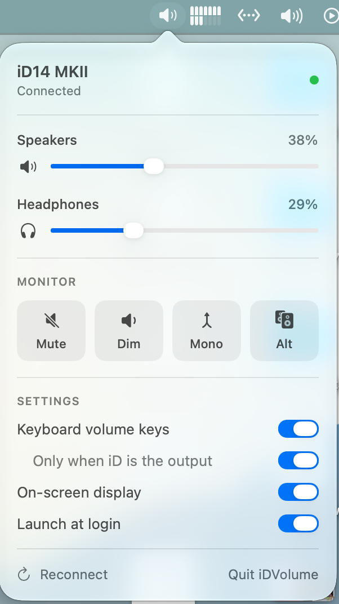

<p align="center">
  
</p>

<h1 align="center">iDVolume</h1>

<p align="center">
  Control your Audient iD interface's monitor volume from the macOS menu bar —<br>
  no reaching for the knob, no heavyweight mixer app.
</p>

<p align="center">
  
</p>

## Features

- **Menu bar sliders** for speaker and headphone level
- **Keyboard volume keys** (F10/F11/F12, Touch Bar) control the iD — only while it's the
  selected output, so built-in speakers and AirPods behave normally. Option+Shift for fine steps.
- **Scroll over the menu bar icon** to change volume
- **On-screen display** when using the keys or scroll (can be turned off)
- **Monitor switches**: Mute, Dim, Mono, Alt speakers
- Talks to the interface directly over USB — audio keeps playing, nothing else to install
- Launch at login

## Compatibility

| | |
|---|---|
| macOS | 13 Ventura or later |
| Tested | Audient **iD14 MKII** |
| Should work | iD14, iD4, iD4 MKII, iD22, iD24, iD44, iD44 MKII, iD48 — untested, reports welcome |

## Install

There's no pre-built download yet, so you build it yourself (takes a few seconds).
You need Xcode or the Command Line Tools (`xcode-select --install`).

```sh
git clone https://github.com/VinneyUK/iDVolume.git
cd iDVolume
./build.sh
cp -R build/iDVolume.app /Applications/
open /Applications/iDVolume.app
```

**Before using it for the first time, turn your monitors down.** The app can't read the
interface's current level, so the first slider move sets the hardware to the slider position.

### Test from the command line (optional)

```sh
./build/idvol              # detect the interface
./build/idvol 0.3          # speakers to 30%
./build/idvol 0.4 phones   # headphones to 40%
./build/idvol dim on       # dim | mono | alt | polarity — on | off
```

## Permissions

The keyboard volume keys need **Accessibility** access (System Settings → Privacy & Security
→ Accessibility). The app asks the first time.

`build.sh` signs with your Apple Development certificate if you have one, which keeps that
permission across rebuilds. Without one it signs ad-hoc and macOS forgets the permission each
build — reset it with:

```sh
tccutil reset Accessibility com.ant.idvolume
```

## Known limitations

- **Write-only.** The iD's current volume and switch states can't be read back yet, so
  turning the hardware knob won't move the slider. The app re-sends its Dim/Mono/Alt state
  when the interface connects.
- The slider curve assumes standard USB Audio units (1/256 dB) over a 64 dB range —
  adjust `AUD_DEFAULT_FLOOR_DB` in `Sources/AudientUSB.h` if it feels off.
- Quit Audient's own iD app while using this, so the two don't fight.

## How it works

The iD's mixer is controlled with USB Audio class `SET_CUR` requests. iDVolume sends them
through IOKit to the interface's spare DFU interface, so Core Audio keeps the audio
interfaces and playback isn't interrupted. The volume keys are captured with a `CGEvent` tap.

## Credits

The USB protocol comes from [MixiD](https://github.com/TheOnlyJoey/MixiD) by
[@TheOnlyJoey](https://github.com/TheOnlyJoey) — an unofficial Linux control panel for the
iD series. Thank you!

## Disclaimer

Unofficial. Not affiliated with, endorsed by, or supported by Audient. "Audient" and "iD" are
trademarks of their respective owner. Use at your own risk.

## License

[MIT](LICENSE)
